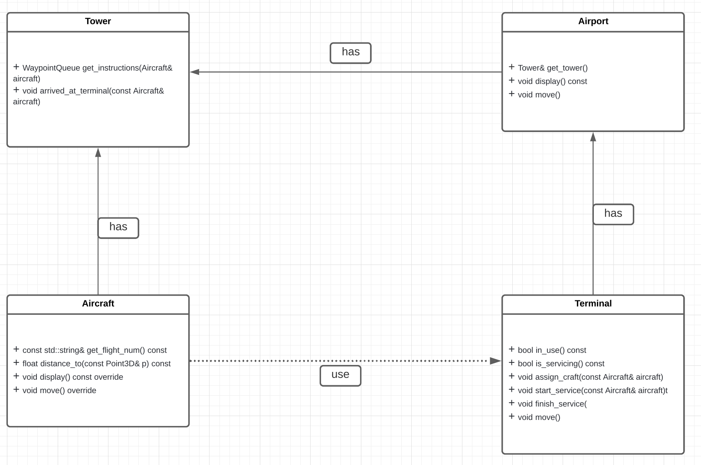

# Se familiariser avec l'existant

## A- Exécution

Compilez et lancez le programme.

Allez dans le fichier `tower_sim.cpp` et recherchez la fonction responsable de gérer les inputs du programme.
Sur quelle touche faut-il appuyer pour ajouter un avion ?
Comment faire pour quitter le programme ?
A quoi sert la touche 'F' ?

```
La fonction responsable de gérer les inputs du programme est create_keystrokes()
Pour ajouter un avion il faut appuyer sur la touche `C` 
Pour quitter le programme il faut appuyer sur la touche `Q` ou `X`  
La touche `F` sert à activer le mode plein ecran 
```

Ajoutez un avion à la simulation et attendez.
Que est le comportement de l'avion ?
Quelles informations s'affichent dans la console ?

```
`Comportement de l'avion` : 
    L'avion attérit sur la piste, roule jusqu'au terminal et récupère les passagers puis quitte la piste

`Informations qui s'affichent sur la console` :

    AF3479 is now landing...    

    now servicing AF3479...

    done servicing AF3479

    AF3479 lift off
```

Ajoutez maintenant quatre avions d'un coup dans la simulation.
Que fait chacun des avions ?

```
Les 3 avions suivent le processus décrit ci-dessus et le 4e vole en attendant qu'un terminal se libère. Lorsque le 4e avion quitte la piste, les 3 y reviennent et ainsi de suite
```

## B- Analyse du code

Listez les classes du programme à la racine du dossier src/.
Pour chacune d'entre elle, expliquez ce qu'elle représente et son rôle dans le programme.

```
`Aircraft_types` : définit les différents types d'avions
`Aircraft`       : représente un avion
`Airport_type`   : définit les différents types d'aéroports
`Airport`        : représente un aéroport 
`Config`         : définit la configuration du jeu
`Geometry`       : définit les structures géométriques 
`Tower-sim`      : représente la simulation 
`Tower`          : représente un tour de contrôle
`Waypoint`       : représente un point de passage
```

Pour les classes `Tower`, `Aircaft`, `Airport` et `Terminal`, listez leurs fonctions-membre publiques et expliquez précisément à quoi elles servent.

```
- `Tower`
   - `WaypointQueue get_instructions(Aircraft& aircraft)` : Renvoie une queue des points représentant le chemin à suivre pour l'avion 
   - `void arrived_at_terminal(const Aircraft& aircraft)` : Modifie l'aéroport pour signaler que cette Tower est occupé par un avion et commence l'embarquement pour aircraft

 - Aircraft
   - `const std::string& get_flight_num() const` : renvoie le numéros de vol de l'avion
   - `float distance_to(const Point3D& p) const` : renvoie la distance entre l'avion et le point passé en paramètre 
   - `void display() const override`             : affiche l'avion à sa position
   - `void move() override`                      : déplace l'avion jusqu'au prochain point de passage

 - Airport
   - `Tower& get_tower()`     : renvoie le Tower associé
   - `void display() const`   : affiche l'aeroport
   - `void move()`            : fait avancer la simulation des terminaux jusqu'au prochain point de passage

 - Terminal
   - `bool in_use() const`                           : renvoie True si le Terminal est occupé par un avion
   - `bool is_servicing() const`                     : renvoie True s'il y a un embarquement ou débarquement en cour sur ce Terminal 
   - `void assign_craft(const Aircraft& aircraft)`   : assigne un nouvel avion au Terminal
   - `void start_service(const Aircraft& aircraft)`  : commence un cycle de service du terminal (embarquement ou débarquement)
   - `void finish_service()`                         : passe le Terminal en mode disponible (termine le service)
   - `void move()`                                   : avance d'un cran dans le cycle de service

```
Réalisez ensuite un schéma présentant comment ces différentes classes intéragissent ensemble.



Quelles classes et fonctions sont impliquées dans la génération du chemin d'un avion ?

```
Les classes qui sont impliquées dans la génération du chemin d'un avion sont : Tower avec sa méthode get_instructions et Waypoint (un chemin est une successions de waypoint).
```
Quel conteneur de la librairie standard a été choisi pour représenter le chemin ?
Expliquez les intérêts de ce choix.

```
Le chemin (les points de passage) est stocké dans une **deque : std::deque<Waypoint>**. Il permet d'ajouter et de supprimer en tête/fin en O(1).
```
## C- Bidouillons !

1) Déterminez à quel endroit du code sont définies les vitesses maximales et accélération de chaque avion.

```cpp
Les vitesses maximales et accélération de chaque avion sont définies dans la fonction : inline void init_aircraft_types() dans aircraf_types.hpp
```

2) Identifiez quelle variable contrôle le framerate de la simulation.\
```cpp
Le framerate de la simulation est contrôlé par la variable GL::ticks_per_sec dans opengl_interface.
```
Le framerate correspond au temps de rafraichissement du programme, c'est-à-dire le nombre de fois où les éléments du programme seront mis à jour (ajout de nouvel avion à la simulation, déplacement, etc) en une seconde.\
Ajoutez deux nouveaux inputs au programme permettant d'augmenter ou de diminuer cette valeur.
```cpp
GL::keystrokes.emplace('a', []() { GL::ticks_per_sec++;}); 
GL::keystrokes.emplace('d', []() { GL::ticks_per_sec --;});  
```
Essayez maintenant de mettre en pause le programme en manipulant ce framerate. Que se passe-t-il ?
```cpp
Si Gl::ticks_per_sec vaut 0 on observe une floating point exception car dans la fonction `void timer(const int step)` on divise par 0 : glutTimerFunc(1000u / ticks_per_sec, timer, step + 1);
```
Ajoutez une nouvelle fonctionnalité au programme pour mettre le programme en pause, et qui ne passe pas par le framerate.
```cpp
GL::keystrokes.emplace('p', []() { GL::toggle_pause();}); et on implémente la fonction toggle_pause dans opengl_interface.
```

3) Identifiez quelle variable contrôle le temps de débarquement des avions et doublez-le.
```
Le temps de débarquement des avions est contrôlé par la varriable SERVICE_CYCLES dans config
```

4) Lorsqu'un avion a décollé, il réattérit peu de temps après.
Assurez-vous qu'à la place, il soit supprimé de la `move_queue`.\
Pour tester, il suffit de dézoomer et de vérifier que les avions suffisament éloignés ne bougent plus.
Indices :\
A quel endroit pouvez-vous savoir que l'avion doit être supprimé ?\
```
 On peut savoir que l'on peut supprimer un avion quand il ne possède plus de waypoint et qu'il a déjà atteri.
Dans la fonction get_instructions de tower.cpp, cela correspond au bloc conditionel où est écrit le commentaire "get a path for the craft to start".
```
Pourquoi n'est-il pas sûr de procéder au retrait de l'avion dans cette fonction ?
```
On ne peut pas le supprimer ici car on modifierai la structure alors qu'on la parcours à l'aide d'une boucle foreach; ca invaliderait l'itérateur.
```
A quel endroit de la callstack pourriez-vous le faire à la place ?\
Que devez-vous modifier pour transmettre l'information de la première à la seconde fonction ?
```
Il faudrait  transmettre l'information à la méthode timer et ensuite retirer les avions après être sorti de l'iterator. 
J'ai changé la signature de la fonction move de Aircraft pour qu'elle renvoie un bool pour savoir si l'objet peut encore se déplacer ou non. Si nous n'avons plus de waypoints, alors on est sorti et donc on peut retourner true.
```

5) Lorsqu'un objet de type `Displayable` est créé, il faut ajouter celui-ci manuellement dans la liste des objets à afficher.
Il faut également penser à le supprimer de cette liste avant de le détruire.
Faites en sorte que l'ajout et la suppression de `display_queue` soit "automatiquement gérée" lorsqu'un `Displayable` est créé ou détruit. Pourquoi n'est-il pas spécialement pertinent d'en faire de même pour `DynamicObject` ?

```
Parce que l'avion est le seul objet qu'on voudrait éventuellement faire disparaitre.
```
Essayez maintenant de supprimer complètement l'avion du programme lorsque vous le retirez de la `move_queue`.\
En dézoomant, vous devriez maintenant constater que les avions disparaissent maintenant de l'écran.

6) La tour de contrôle a besoin de stocker pour tout `Aircraft` le `Terminal` qui lui est actuellement attribué, afin de pouvoir le libérer une fois que l'avion décolle.
Cette information est actuellement enregistrée dans un `std::vector<std::pair<const Aircraft*, size_t>>` (size_t représentant l'indice du terminal).
Cela fait que la recherche du terminal associé à un avion est réalisée en temps linéaire, par rapport au nombre total de terminaux.
Cela n'est pas grave tant que ce nombre est petit, mais pour préparer l'avenir, on aimerait bien remplacer le vector par un conteneur qui garantira des opérations efficaces, même s'il y a beaucoup de terminaux.\
Modifiez le code afin d'utiliser un conteneur STL plus adapté. Normalement, à la fin, la fonction `find_craft_and_terminal(const Aicraft&)` ne devrait plus être nécessaire.

## D- Théorie

1) Comment a-t-on fait pour que seule la classe `Tower` puisse réserver un terminal de l'aéroport ?

```
La fonction reserve_terminal de Airport est privée et la seule classe friendly de Airport est Tower. De plus, la classe n'a aucun setter public.
```

2) En regardant le contenu de la fonction `void Aircraft::turn(Point3D direction)`, pourquoi selon-vous ne sommes-nous pas passer par une réference constante ?

```
Parce que la méthode cap_length() renvoie déjà une référence sur un Point3D. Lors de l'utilisation de cette fonction, le `Point3D` en question n'est pas un objet (crée par un constructeur) mais est le résultat d'un calcul, et par conséquent n'a pas de référence.
```

Pourquoi n'est-il pas possible d'éviter la copie du `Point3D` passé en paramètre ?

```
Non car dans la méthode cap_length() le Point3D est modifié.
```
## E- Bonus

Le temps qui s'écoule dans la simulation dépend du framerate du programme.
La fonction move() n'utilise pas le vrai temps. Faites en sorte que si.
Par conséquent, lorsque vous augmentez le framerate, la simulation s'exécute plus rapidement, et si vous le diminuez, celle-ci s'exécute plus lentement.

Dans la plupart des jeux ou logiciels que vous utilisez, lorsque le framerate diminue, vous ne le ressentez quasiment pas (en tout cas, tant que celui-ci ne diminue pas trop).
Pour avoir ce type de résultat, les fonctions d'update prennent généralement en paramètre le temps qui s'est écoulé depuis la dernière frame, et l'utilise pour calculer le mouvement des entités.

Recherchez sur Internet comment obtenir le temps courant en C++ et arrangez-vous pour calculer le dt (delta time) qui s'écoule entre deux frames.
Lorsque le programme tourne bien, celui-ci devrait être quasiment égale à 1/framerate.
Cependant, si le programme se met à ramer et que la callback de glutTimerFunc est appelée en retard (oui oui, c'est possible), alors votre dt devrait être supérieur à 1/framerate.

Passez ensuite cette valeur à la fonction `move` des `DynamicObject`, et utilisez-la pour calculer les nouvelles positions de chaque avion.
Vérifiez maintenant en exécutant le programme que, lorsque augmentez le framerate du programme, vous n'augmentez pas la vitesse de la simulation.

Ajoutez ensuite deux nouveaux inputs permettant d'accélérer ou de ralentir la simulation.
